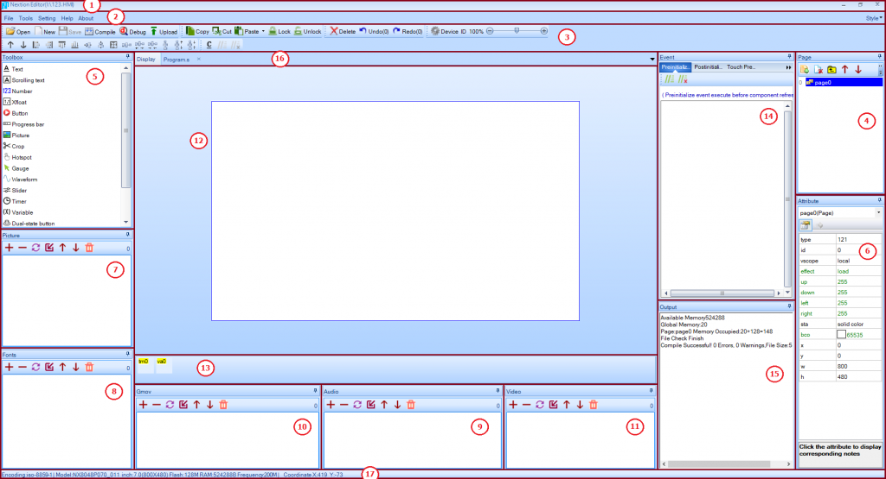

# Nextion Display Run Ones



I feltet mærket (16), skal vi vælge fanebladet **Program.s**, og tilføje linien **lcd_dev fffb 0002 0000 0020** for at få løst et problem med EU-versionen af NSPanel.

## Program.s
```
// The following code is only run once when power on, and is generally used for global variable definition and power on initialization data.
// At present, the definition of global variable only supports 4-byte signed integer (int), and other types of global quantity declaration are not supported. If you want to use string type, you can use variable control in the page to implement.

int sys0=0,sys1=0,sys2=0
lcd_dev fffb 0002 0000 0020  // Fix problem with Sonoff NSPanel EU-version
page 0                       // Power on start page 0
```
