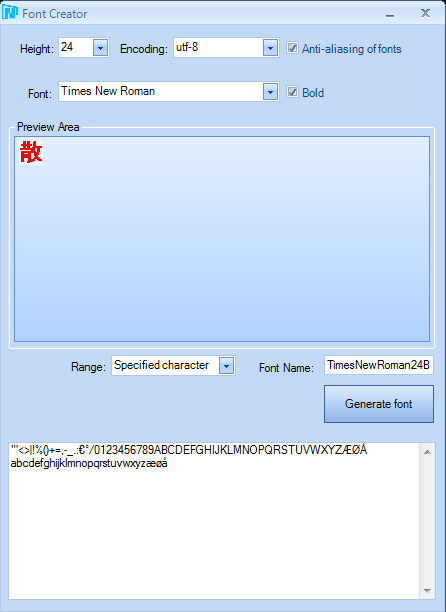
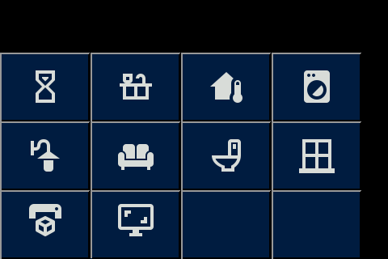
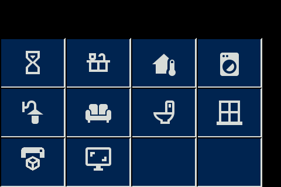
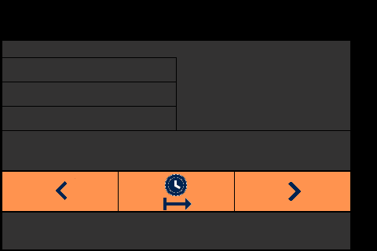
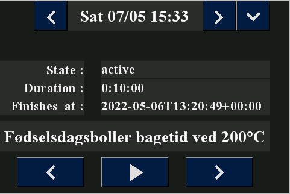

# New Page Layout

## New template 

## Font
I limit the number of Character in the font, that way I limit the memory the font used, here is a lis of the Character Iused:
```
"'<>|!%()+=,-_.:€°/0123456789ABCDEFGHIJKLMNOPQRSTUVWXYZÆØÅ abcdefghijklmnopqrstuvwxyzæøå
```
Here is an exsample from Nextion Editor's Font Generator:



And here is how it look like in font selector: 
* ID:0 TimesNewRoman30B(h:30,encode:utf-8,qty:88,datasize:8.12K)
* ID:1 TimesNewRoman24B(h:24,encode:utf-8,qty:88,datasize:5.56K)

# Nextion Color:
Click Here for [Nextion HMI Color Converter  ](https://nodtem66.github.io/nextion-hmi-color-convert/index.html)  

| Gimp-RGB      | Gimp-HEX | Nextion-HMI | Name       |                 Color                      | Used for           |
|:---:           |:---:      |---:         |:---        |:---:                                       |:---                |
| (0,0,0)       | #000000  | 0           | Black      |           | Display background |
| (24,28,24)    | #181C18  | 6371        | Dark Gray  |    | Page Background    |
| (40,44,40)    | #282C28  | 10597       | Gray       |             | Text Background    |
| (248,252,248) | #F8FCF8  | 65535       | White      |           | Text, Icon|
| (152,152,152) | #989898  | 40147       | light Gray |  | Button top & left border |
| (0,28,64)     | #001C40  | 232         | Dark Blue  |    | Button Off |
| (0,36,80)     | #002450  | 298         | Light Blue |  | Button On  |
| (216,220,216) | #D8DCD8  | 55034       | Light White|           | Button botten & right border |
| (248,216,48)  | #F8D830  | 65222       | Yellow     |         | Marking Active like Home Assistant|

# Nextion Code:
## Program.s - is run one time at boot
```
// The following code is only run once when power on, and is generally used for global variable definition and power on initialization data.
// At present, the definition of global variable only supports 4-byte signed integer (int), and other types of global quantity declaration are not supported. If you want to use string type, you can use variable control in the page to implement.

int sys0=0,sys1=0,sys2=0
lcd_dev fffb 0002 0000 0020  // Fix problem with Sonoff NSPanel EU-version
page 0                       // Power on start page 0
```

## Page Attribute:
| Name       | All page    | ScreenSaver |
|---:        |:---:        |:---:        |
| PageId:    |             |             |
| type:      | 121         | 121         |
| id:        | 0           | 0           |
| vscope:    | local       | local       |
| sta:       | solid color | solid color |
| ***bco:*** | ***6371***  | 0           |
| x:         | 0           | 0           |
| y:         | 0           | 0           |
| w:         | 480         | 480         |
| h:         | 320         | 320         |

## Page ScreenSaver 
### Non Visual Components
| Atribute      | Variable         | Variable          | Variable       | Variable       | Variable      | Variable      |
|---:           |:---:             |:---:              |:---:           |:---:           |:---:          |:---:          |
| type:         | 52               | 52                | 52             | 52             | 52            | 52            |
| id:           | 1                | 2                 | 3              | 4              | 5             | 6             |
| objname:      | ***brightness*** | ***DisplayTime*** | ***PrevPage*** | ***NextPage*** | ***MinPage*** | ***MaxPage*** |
| ***vscope:*** | ***global***     | ***global***      | ***global***   | ***global***   | ***global***  | ***global***  |
| sta:          | Number           | Number            | Number         | Number         | Number        | Number        |
| ***val:***    | ***100***        | ***30000***       | 0              | 0              | ***0***       | ***10***      |

### Page ScreenSaver - Touch Release Event:
```
dim=ScreenSaver.brightness.val  // Un-blank the screen
page CookTimer                  // Switch back to page 0
```

## All Pages with the exception of ScreenSaver page
### Non Visual Components
| Atribute | Timer | TouchCap |
|---:      |:---:  |:---:     |
| type:    | 51    | 5        |
| id:      | 5     | 6        |
| objname: | tm0   | tc0      |
| vscope:  | local | local    |
| tim:     | 400   | -------- |
| en:      | 1     | -------- |
| val:     | ----- | 0        |

### Page - Preinitialize Event
```
// set time before screensaver 
tm0.tim=ScreenSaver.DisplayTime.val
// set value for Previous page no.
if(dp>ScreenSaver.MinPage.val)
{
  ScreenSaver.PrevPage.val=dp-1
}else
{
  ScreenSaver.PrevPage.val=ScreenSaver.MaxPage.val
}
// set value for next page no.
if(dp<ScreenSaver.MaxPage.val)
{
  ScreenSaver.NextPage.val=dp+1
}else
{
  ScreenSaver.NextPage.val=ScreenSaver.MinPage.val
}
```

### Timer Event
```
// Turn screen off
ScreenSaver.brightness.val=dim
dim=0
// Go to screensaver page
page ScreenSaver 
```
### TouchCap
#### Touch Release Event()
```
// Reset sleep timer
sleep_timer.en=1
```
## Page Navigation All Pages with the exception of ScreenSaver page
### Images of navagations key's
|  No Key Press ID:0 | Key Presed ID:1 |
|:---: |:---: |
| Navigation Keys |  |
||  |

### Visual Navigation Components on All Pages with the exception of ScreenSaver page:
| Atribute        | Prev button      | Next button      | Quick button     | Time/PageName     |
|---:             |:---:             |:---:             |:---:             |:---:              |
| type:           | 98               | 98               | 98               | 116               |
| id:             | **1**            | **2**            | **3**            | **4**             |         
| objname:        | b0               | b1               | b2               | t0                |
| vscope:         | local            | local            | local            | global            |
| ***sta:***      | ***corp image*** | ***corp image*** | ***corp image*** | ***solid color*** | 
| style:          | ---------------- | ---------------- | ---------------- | flat              |
| key:            | ---------------- | ---------------- | ---------------- | None              |
| font:           | 0                | 0                | 0                | 0                 |
| bco:            | ---------------- | ---------------- | ---------------- | 10597             |
| pco:            | ---------------- | ---------------- | ---------------- | 65535             |
| ***picc:***     | ***0***          | ***0***          | ***0***          | ----------------- |
| ***picc2:***    | ***1***          | ***1***          | ***1***          | ----------------- |
| ***pco:***      | ***0***          | ***0***          | ***0***          | ----------------- |
| ***pco2:***     | ***65535***      | ***65535***      | ***65535***      | ----------------- |
| xcen:           | Center           | Center           | Center           | Center            |
| ycen:           | Center           | Center           | Center           | Center            |
| pw:             | ---------------- | ---------------- | ---------------- | Character         |
| ***txt:***      |                  |                  |                  | ***PageName***    |
| ***txt_maxi:*** | 10               | 10               | 10               | ***20***          |
| isbr:           | False            | False            | False            | False             |
| spax:           | 0                | 0                | 0                | 0                 |
| spay:           | 0                | 0                | 0                | 0                 |
| ***x:***        | ***56***         | ***336***        | ***392***        | ***112***         |
| ***y:***        | ***0***          | ***0***          | ***0***          | ***0***           |
| ***w:***        | ***56***         | ***56***         | ***56***         | ***56***          |
| ***h:***        | ***50***         | ***50***         | ***50***         | ***50***          |
| Code:                    |                                    |                                   |                 | |
|***Touch Release Event:***| ***page ScreenSaver.PrevPage.val***|***page ScreenSaver.NextPage.val***| ***page Quick***| |


## Visual Quick Navigation Components:
### Images for quick navigation:
|  No Key Press ID:2  | Key Presed ID:3 |
|:---: |:---: |
| Quick Navigation page | |
||  |

### Visual Navigation Components on All Pages with the exception of ScreenSaver page:
| Atribute        | Cookingtimer     | Kitchen          | Climate          | Laundry          |
|---:             |:---:             |:---:             |:---:             |:---:             |
| type:           | 98               | 98               | 98               | 98               |
| id:             | **4**            | **5**            | **6**            | **7**            |
| objname:        | b3               | b4               | b5               | b6               |
| vscope:         | local            | local            | local            | local            |
| ***sta:***      | ***corp image*** | ***corp image*** | ***corp image*** | ***corp image*** |
| font:           | 0                | 0                | 0                | 0                |
| ***picc:***     | ***4***          | ***4***          | ***4***          | ***4***          |
| ***picc2:***    | ***5***          | ***5***          | ***5***          | ***5***          |
| ***pco:***      | ***0***          | ***0***          | ***0***          | ***0***          |
| ***pco2:***     | ***65535***      | ***65535***      | ***65535***      | ***65535***      |
| xcen:           | Center           | Center           | Center           | Center           |
| ycen:           | Center           | Center           | Center           | Center           |
| ***txt:***      |                  |                  |                  |                  |
| ***txt_maxi:*** | 10               | 10               | 10               | 10               |
| isbr:           | False            | False            | False            | False            |
| spax:           | 0                | 0                | 0                | 0                |
| spay:           | 0                | 0                | 0                | 0                |
| ***x:***        | ***0***          | ***112***        | ***224***        | ***336***        |
| ***y:***        | ***65***         | ***65***         | ***65***         | ***65***         |
| ***w:***        | ***112***        | ***112***        | ***112***        | ***112***        |
| ***h:***        | ***85***         | ***85***         | ***85***         | ***85***         |
| Code:           |                  |                  |                  |                  |
|***Touch Release Event:***|***page CookTimer***|***page page Kitchen***|***page Climate***|***page Laundry***|

| Atribute        | FrontDoor        | LivingRoom       | Toilet           | Windows          |
|---:             |:---:             |:---:             |:---:             |:---:             |
| type:           | 98               | 98               | 98               | 98               |
| id:             | **8**            | **9**            | **10**           | **11**           |
| objname:        | b7               | b8               | b9               | b10              |
| vscope:         | local            | local            | local            | local            |
| ***sta:***      | ***corp image*** | ***corp image*** | ***corp image*** | ***corp image*** |
| font:           | 0                | 0                | 0                | 0                |
| ***picc:***     | ***4***          | ***4***          | ***4***          | ***4***          |
| ***picc2:***    | ***5***          | ***5***          | ***5***          | ***5***          |
| ***pco:***      | ***0***          | ***0***          | ***0***          | ***0***          |
| ***pco2:***     | ***65535***      | ***65535***      | ***65535***      | ***65535***      |
| xcen:           | Center           | Center           | Center           | Center           |
| ycen:           | Center           | Center           | Center           | Center           |
| ***txt:***      |                  |                  |                  |                  |
| ***txt_maxi:*** | 10               | 10               | 10               | 10               |
| isbr:           | False            | False            | False            | False            |
| spax:           | 0                | 0                | 0                | 0                |
| spay:           | 0                | 0                | 0                | 0                |
| ***x:***        | ***0***          | ***112***        | ***224***        | ***336***        |
| ***y:***        | ***150***        | ***150***        | ***150***        | ***150***        |
| ***w:***        | ***112***        | ***112***        | ***112***        | ***112***        |
| ***h:***        | ***85***         | ***85***         | ***85***         | ***85***         |
| Code:           |                  |                  |                  |                  |
|***Touch Release Event:***|***page FrontDoor***|***page Livingroom***|***page Toilet***|***page Windows***|

| Atribute        | 3DPrinter        | PCScreen         |                  |                  |
|---:             |:---:             |:---:             |:---:             |:---:             |
| type:           | 98               | 98               | 98               | 98               |
| id:             | **12**           | **13**           |                  |                  |
| objname:        | b11              | b12              |                  |                  |
| vscope:         | local            | local            | local            | local            |
| ***sta:***      | ***corp image*** | ***corp image*** | ***corp image*** | ***corp image*** |
| font:           | 0                | 0                | 0                | 0                |
| ***picc:***     | ***4***          | ***4***          | ***4***          | ***4***          |
| ***picc2:***    | ***5***          | ***5***          | ***5***          | ***5***          |
| ***pco:***      | ***0***          | ***0***          | ***0***          | ***0***          |
| ***pco2:***     | ***65535***      | ***65535***      | ***65535***      | ***65535***      |
| xcen:           | Center           | Center           | Center           | Center           |
| ycen:           | Center           | Center           | Center           | Center           |
| ***txt:***      |                  |                  |                  |                  |
| ***txt_maxi:*** | 10               | 10               | 10               | 10               |
| isbr:           | False            | False            | False            | False            |
| spax:           | 0                | 0                | 0                | 0                |
| spay:           | 0                | 0                | 0                | 0                |
| ***x:***        | ***0***          | ***112***        | ***224***        | ***336***        |
| ***y:***        | ***235***        | ***235***        | ***235***        | ***235***        |
| ***w:***        | ***112***        | ***112***        | ***112***        | ***112***        |
| ***h:***        | ***85***         | ***85***         | ***85***         | ***85***         |
| Code:                    |                  |                  |         |                  |
|***Touch Release Event:***|***page Printer***|***page PcScreen**|         |                  |


## Page CookTimer:
### Images of cooking timer page:
|  No Key Press ID:4  | Key Presed ID:5|
|:---: |:---: |
| CookTimer Keys|  |
||  |

### Button for navigate cookong timer:
This butten will send event to NSPanel's ESP32 for Press and Release Event: 
| Atribute        | Prev button      | Start button     | Next button      |
|---:             |:---:             |:---:             |:---:             |
| type:           | 98               | 98               | 98               |
| id:             | **4**            | **5**            | **6**            |
| objname:        | b3_Prev          | b4_Start         | b5_Next          |
| vscope:         | global           | global           | global           |
| ***sta:***      | ***corp image*** | ***corp image*** | ***corp image*** |
| font:           | 0                | 0                | 0                |
| ***picc:***     | ***4***          | ***4***          | ***4***          |
| ***picc2:***    | ***5***          | ***5***          | ***5***          |
| ***pco:***      | ***0***          | ***0***          | ***0***          |
| ***pco2:***     | ***65535***      | ***65535***      | ***65535***      |
| xcen:           | Center           | Center           | Center           |
| ycen:           | Center           | Center           | Center           |
| pw:             | ---------------- | ---------------- | ---------------- |
| ***txt:***      |                  |                  |                  |
| ***txt_maxi:*** | 10               | 10               | 10               |
| isbr:           | False            | False            | False            |
| spax:           | 0                | 0                | 0                |
| spay:           | 0                | 0                | 0                |
| ***x:***        | ***28***         | ***168***        | ***308***        |
| ***y:***        | ***260***        | ***260***        | ***260***        |
| ***w:***        | ***112***        | ***112***        | ***112***        |
| ***h:***        | ***50***         | ***50***         | ***50***         |
| Code:           |                  |                  |                  |
| -Touch Press Event:|               |                  |                  |
| --Send Component ID: | ***Enabled*** | ***Enabled***  | ***Enabled***    |
| -Touch Release Event:|             |                  |                  |
| --Send Component ID: | ***Enabled*** | ***Enabled***  | ***Enabled***    |


### Text Boxes for timer data from Home Assistant:
|  CookTimerActve  |
|:---: |
||

| Atribute        | timer Frendly name | timer state | timer state txt | timer duration | timer duration txt | timer finish | timer finish txt |
|---:             |:---:               |:---:        |:---:            |:---:           |:---:               |:---:         |:---:             |
| type:           | 116                | 116         | 116             | 116            | 116                | 116          | 116              |
| id:             |                    |             |                 |                |                    |              |                  |
| ***objname:***  | ***t1_Frendly***   | ***t2***    | ***t2_State***  | ***t3***       | ***t3_Duration***  | ***t3***     | ***t3_Finish***  |
| ***vscope:***   | ***global***       | local       | ***global***    | local          | ***global***       | local        | ***global***     |
| sta:            | solid color        | solid color | solid color     | solid color    | solid color        | solid color  | solid color      |
| style:          | flat               | flat        | flat            | flat           | flat               | flat         | flat             |
| key:            | None               | None        | None            | None           | None               | None         | None             |
| font:           | 0                  | 0           | 0               | 0              | 0                  | 0            | 0                |
| ***bco:***      | ***10597***        | ***10597*** | ***10597***     | ***10597***    | ***10597***        | ***10597***  | ***10597***      |
| ***pco:***      | ***65535***        | ***65535*** | ***65535***     | ***65535***    | ***65535***        | ***65535***  | ***65535***      |
| ***xcen:***     | Center             | ***Right*** | ***Left***      | ***Right***    | ***Left***         | ***Right***  | ***Left***       |
| ycen:           | Center             | Center      | Center          | Center         | Center             | Center       | Center           |
| pw:             | Character          | Character   | Character       | Character      | Character          | Character    | Character        |
| ***txt:***      | ***frendly name*** | ***State:***|***timer state***|***Duration:*** |***timer duration***|***Finishes at:***|***timer finish***| 
| ***txt_maxi:*** | ***40***           | 10          | 10              | 10             | 10                 | 10           | 10               |
| isbr:           | False              | False       | False           | False          | False              | False        | False            |
| spax:           | 0                  | 0           | 0               | 0              | 0                  | 0            | 0                |
| spay:           | 0                  | 0           | 0               | 0              | 0                  | 0            | 0                |
| ***x:***        | ***0***            | ***0***     | ***168***       | ***0***        | ***168***          | ***0***      | ***168***        |
| ***y:***        | ***200***          | ***100***   | ***100***       | ***130***      | ***130***          | ***160***    | ***160***        |
| ***w:***        | ***448***          | ***140***   | ***280***       | ***140***      | ***280***          | ***140***    | ***280***        |
| ***h:***        | ***50***           | 30          | 30              | 30             | 30                 | 30           | 30               |
