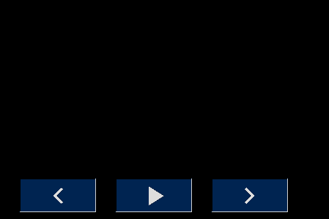

# New Page Layout

## New template 

## Font
I limit the number of Character in the font, that way I limit the memory the font used, here is a lis of the Character Iused:
```
"'<>|!%()+=,-_.:€°/0123456789ABCDEFGHIJKLMNOPQRSTUVWXYZÆØÅ abcdefghijklmnopqrstuvwxyzæøå
```
Here is an exsample from Nextion Editor's Font Generator:


And here is how it look like in font selector: 
* ID:0 TimesNewRoman30B(h:30,encode:utf-8,qty:88,datasize:8.12K)
* ID:1 TimesNewRoman24B(h:24,encode:utf-8,qty:88,datasize:5.56K)

# Nextion Color:
Click Here for [Nextion HMI Color Converter  ](https://nodtem66.github.io/nextion-hmi-color-convert/index.html)  

| Gimp-RGB      | Gimp-HEX | Nextion-HMI | Name       |                 Color                      | Used for           |
|:---:           |:---:      |---:         |:---        |:---:                                       |:---                |
| (0,0,0)       | #000000  | 0           | Black      |           | Display background |
| (24,28,24)    | #181C18  | 6371        | Dark Gray  |    | Page Background    |
| (40,44,40)    | #282C28  | 10597       | Gray       |             | Text Background    |
| (248,252,248) | #F8FCF8  | 65535       | White      |           | Text, Icon|
| (152,152,152) | #989898  | 40147       | light Gray |  | Button top & left border |
| (0,28,64)     | #001C40  | 232         | Dark Blue  |    | Button Off |
| (0,36,80)     | #002450  | 298         | Light Blue |  | Button On  |
| (216,220,216) | #D8DCD8  | 55034       | Light White|           | Button botten & right border |
| (248,216,48)  | #F8D830  | 65222       | Yellow     |         | Marking Active like Home Assistant|

# Nextion Code:
## Program.s - is run one time at boot
```
// The following code is only run once when power on, and is generally used for global variable definition and power on initialization data.
// At present, the definition of global variable only supports 4-byte signed integer (int), and other types of global quantity declaration are not supported. If you want to use string type, you can use variable control in the page to implement.

int sys0=0,sys1=0,sys2=0
lcd_dev fffb 0002 0000 0020  // Fix problem with Sonoff NSPanel EU-version
page 0                       // Power on start page 0
```

## Page Keys:
|  No Key Press  | Key Presed |
|:---: |:---: |
| Navigation Keys |  |
||  |
| CookTimer Keys|  |
||  |

## Page Attribute:
| Name    | Navi        | CookTimer   | ScreenSaver |
|---:     |:---:        |:---:        |:---:        |
| PageId: | 0           | 1           | 2           |
| type:   | 121         | 121         | 121         |
| id:     | 0           | 0           | 0           |
| vscope: | local       | local       | local       |
| sta:    | solid color | solid color | solid color |
| bco:    | 6371        | 6371        | 0           |
| x:      | 0           | 0           | 0           |
| y:      | 0           | 0           | 0           |
| w:      | 480         | 480         | 480         |
| h:      | 320         | 320         | 320         |


## Page Navi, CookTimer
### Non Visual Components
| Atribute | Timer       | TouchCap |
|---:      |:---:        |:---:     |
| type:    | 51          | 5        |
| id:      | x           | x        |
| objname: | sleep_timer | tc0      |
| vscope:  | local       | local    |
| tim:     | 30000       | -------- |
| en:      | 1           | -------- |
| val:     | ----------- | 0        |

### Timer Event - Page Navi, CookTimer
```
// Turn screen off
ScreenSaver.brightness.val=dim
dim=0
// Go to screensaver page
page ScreenSaver 
```
### TouchCap - Page Navi, CookTimer
```
Touch Release Event()
//Reset sleep timer
sleep_timer.en=1
```
## Page ScreenSaver 
### Non Visual Components
| Atribute | Variable   |
|---:      |:---:       |
| type:    | 52         |
| id:      | 1          |
| objname: | brightness |
| vscope:  | global     |
| sta:     | Number     |
| val:     | 100        |

### Page Touch Release Event:
```
dim=ScreenSaver.brightness.val  // Un-blank the screen
page Navi                       // Switch back to page 0
```