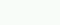

# New Page Layout

## New template 

## Page Navigation
Faveskala:
| Gimp-RGB      | Gimp-HEX | Nextion-HMI | Name       |                 Color                      | Used for           |
|:---           |:---      |:---         |:---        |:---                                        |:---                |
| (0,0,0)       | #000000  | 0           | Black      |           | Display background |
| (24,28,24)    | #181C18  | 6371        | Dark Gray  |    | Page Background    |
| (40,44,40)    | #282C28  | 10597       | Gray       |             | Text Background    |
| (248,252,248) | #F8FCF8  | 65535       | White      |           | Text, Icon & Button botten & right border |
| (152,152,152) | #989898  | 40147       | light Gray |  | Button top & left border |
| (0,28,64)     | #001C40  | 232         | Dark Blue  |    | Button Off |
| (0,36,80)     | #002450  | 298         | Light Blue |  | Button On  |
| (248,216,48)  | #F8D830  | 65222       | Yellow     |         | Marking Active like Home Assistant|

