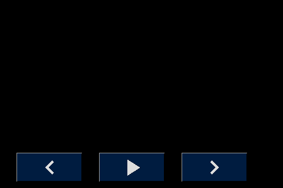
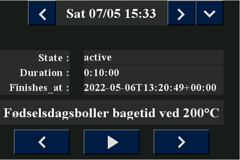

# Home Assistant, NSPanel & Nextions Editor
My work with Nextion Display,  ESPHome and Home Assistant, for this i use Sonoff's NSPanel EU-version.  

## These pages are created for these reasons:
1. to help me remember what I was doing.
2. to share my knowledge with you out there, who want to play with Nextion Display, Home Assistant and ESPHome.

I will try to make as complete documentation as possible, with my thoughts and reasons for my choices, my code for ESPHome, Home Assistant, and my drawings for my 3D-Print which is made in FreeCad and saved as FreeCad files and .stl files.  

I hope you will find something you can use, and you are all welcome to make suggestions and corrections.

## Kilder:
* Youtube:
  * [Christopher Masto's](https://www.youtube.com/channel/UCwjMKIo9bpe8Nf5j8U3YIrw)
    * [Flashing the Sonoff NSPanel with ESPHome - how to get a custom UI for Home Assistant!](https://www.youtube.com/watch?v=Kdf6W_Ied4o)
    * [How to make a Sonoff NSPanel turn off the screen when you're not using it  ](https://www.youtube.com/watch?v=zndPIPLRjb8)
    * [Sonoff NSPanel Updates: dimming, sleep, and touch calibration, plus show and tell!](https://www.youtube.com/watch?v=aNVGZDUKtuI)
  * [DeanoXX](https://github.com/DeanoXX)
    * [ESPHome Configs](https://github.com/DeanoXX/esphome-config)
  * [Cables & Coffee](https://www.youtube.com/channel/UC8gX8L4G-Dki4AJpy4gijwA)
    * [SONOFF NSPanel Custom ESPHome example. Control entire apartment + dynamic events](https://www.youtube.com/watch?v=g8OUxJEw2dU)
    * [Sonoff NSPanel ESPHome Nextion Editor Tutorial Part 1: Inspiration](https://www.youtube.com/watch?v=mqHWsJLbplA)
    * [Sonoff NSPanel ESPHome Nextion Editor Tutorial Part 2: Nextion Editor, Understanding, Flashing](https://www.youtube.com/watch?v=5ghKIqYd_Bc)

* Github:
  * [Christopher Masto's Documentation on Github](https://github.com/masto)
    * [NSPanel-Demo-Files](https://github.com/masto/NSPanel-Demo-Files)
    * [HowTo](https://github.com/masto/NSPanel-Demo-Files/wiki/HowTo)
  * Cables & Coffee
    * [lillaeriika/NSPanel](https://github.com/lillaeriika/NSPanel)
  * ilyavolodin
    * [ilyavolodin/NSPanel](https://github.com/ilyavolodin/NSPanel) ColorWhell and more about sync.
    * [Syncing slider between HA and Nextion display](https://community.home-assistant.io/t/syncing-slider-between-ha-and-nextion-display/379132/5)

* Other:
  * Blakadder's
    * [Sonoff NSPanel EU Switch in Detail](https://blakadder.com/nspanel-teardown/)

* Dokumentation:
  * Nextion:
    * [Nextion Editor](https://nextion.tech/nextion-editor/)
    * [Nextion Editor Guide](https://nextion.tech/editor_guide/)
    * [The Nextion Instruction Set](https://nextion.tech/instruction-set/)
    * [ESPHome Nextion Display API Reference](https://esphome.io/api/nextion_8h.html)
  * Other:
    * [Nextion HMI Color Converter](https://nodtem66.github.io/nextion-hmi-color-convert/index.html)
    * [Material Design Icons](https://materialdesignicons.com/)
  * ESPHome:
    * [Display Component](https://esphome.io/components/display/index.html)
    * [Nextion TFT LCD Display](https://esphome.io/components/display/nextion.html)

## My First Try:
  

First try is all about getting data all the way from Home Assistant via ESPHome to NSPanel, and button to send signal all the way back from NSPanel via ESPHome to Home Assistant.
In my Home Assistant I have created timer to used when I am cooking and baking, I want to bee able to select the rigth timer and start it from my NSPanel, when timer is finish an automation will bee sewnd with Telegram, and that is werry nice I cn bee in garden and still a notification on my phone.


###  [*Click Here!* for *Explanation* and the *Files* from *First try!*](./First_Try/README.md)
 
<hr>

## My Second Try:  

In my second attempt, I will try to have a more organized approach to the appearance of my NSPanel. 

### Problem with Sonoff NSPanel EU-version.
The problem with the EU version is that the size is limited to 86 x 86 mm in height and width, and to have a symmetrical look you have to cover the last 32 pixels, another thing is that you have obviously waited the display upside down so to use it with the 2 push buttons below the display you have to choose an orientation of 270 degrees, the two things together mean that the buttons that define in the display are not pressure sensitive in the same place as they are shown, this can be solved by running a single line code when starting the display
here is the code stump:
```
lcd_dev fffb 0002 0000 0020 
```
The code is inserted in the [Nextions Editorens Program.s see more Here: ](./NewPageLayout#programs---is-run-one-time-at-boot)

### Fonts:
I was looking at how large fonts I would use for my texts, due to my vision, I would like them to be as large as possible so the longest text I knew I would need formed the background for my font size selection, so I ended up choosing 2 font sizes:  

* TimesNewRoman with font Height 30 and Bold Encoding Utf-8
* TimesNewRoman with font Height 24 and Bold Encoding Utf-8

To limit the fonts memory consumption I chose to limit the number of characters I use in my fonts to these characters:
 * "'<>|!%()+=,-_.:€°/0123456789ABCDEFGHIJKLMNOPQRSTUVWXYZÆØÅ abcdefghijklmnopqrstuvwxyzæøå
  
See more about glyphs here: [ESPHome - Fonts](https://esphome.io/components/display/index.html?highlight=font#fonts).

[*Click Here!* for *Explanation* about my font settings*](https://github.com/sekt1953/HomeAssistant-NSPanel/tree/main/NewPageLayout#font)

<hr>

### Buttons:
I also looked at how big keys I can use, the EU version of NSPanel has 448 usable pixels horizontally and 320px vertically. standard keys in the nextion editor are 100px wide and 50px high, so if I had to use it as a guide for the size of my buttons I would be able to place 4 buttons horizontally and have 48px left, so instead selected characters a button width of 112px, 4 x 112 is 448 pixels.  

As a button height, I chose to stick to the 50px for standard control buttons, an example can be seen below:  

Used with Button's atribute sta: corp image

| Off | On |
|:---:|:---:|
|||

Used with Button's atribute sta: image

| Off | On |
|:---:|:---:|
|||

### Page Navigation:
First, I wanted to have a uniform appearance of my pages, at the top of all pages I wanted a navigation bar, this one should have a button for the ***previous page*** one for the ***next page***, and one for a ***quick shortcut*** to the desired page, I would also like a box for the page ***Logo*** am on and a clock that shows the ***day of the week***, ***date***, ***hours*** and ***minutes***.

Here's the look I ended up with:
| Off | On |
|:---:|:---:|
|||

The blank field on the left is for page Logo, and the blank field in the middle is for the clock.

### Page Navigation Code:
In order not to have to maintain different code for navigation on all pages, I have chosen to insert a little code.  
In the Screensaver page I have created 4 variables which are all global and of the type Number:
* ScreenSaver.prevPage which must contain the ID of the previous page.
* ScreenSaver.nextPage which must contain the ID of teh next page.
* ScreenSaver.minPage which must contain at least pages no.
* ScreenSaver.maxPage which must contain the largest page no.

All pages other than the ScreenSaver page must contain a piece of code which is executed when the page is opened.  

**page.Preinitialize Event:**
```
// set value for Previous page no.
if(dp>ScreenSaver.minPage.val)
{
  ScreenSaver.prevPage.val=dp-1
}else
{
  ScreenSaver.prevPage.val=ScreenSaver.maxPage.val
}
// set value for next page no.
if(dp<ScreenSaver.maxPage.val)
{
  ScreenSaver.nextPage.val=dp+1
}else
{
  ScreenSaver.nextPage.val=ScreenSaver.minPage.val
}
```
And the 3 navigation buttons must contain a piece of code, for Button Touch Release Event.  

**b0.Touch Release Event:** 
```
page ScreenSaver.prevPage.val
```

**b1.Touch Release Event:**
```
page ScreenSaver.nextPage.val
```

**b2.Touch Release Event:**
```
page Quick
```
This way I can change the order of my page, without having to end in the code of all navigation buttons.

### Quick Navigation:
The next thing I chose to do was the page for quick page selection, here I chose a button size of 112 x 85 px, it gave me 12 pages to choose from, and some nice big buttons to press.  
Some thoughts about button size, if I choose 90 x 85 pixels I can have 15 pages directly accessible on the page, I know the last 2 pixels on the right side come under the cover, but I think I can live with this.  

Here you see the Page with spase for 12 page: 
| Off | On |
|:---:|:---:|
|||

The blank field at the top is for the navigation buttons!

I have used Gimp to make my pages in and I have used Material Design Icons for my icons, I used to download the icons as png files in the size 48 x 48 pixels, this size fits well everywhere.
The icons I have used are to be found in the [icon folder](./NewPageLayout/icon/), my files Gimp files can be found in the [xcf folder](./NewPageLayout/xcf/), and the png files can be found in the [png folder](./NewPageLayout/png/).

<hr>

### Color I Use:
The color choice I have used may be a little strange to some; but I have the [red / green color blindness](https://ojenforeningen.dk/udgivelser/farver-farveblindhed) which is quite common for Danish men, and I need a good contrast when I have to read text, therefore my choice.  
The color choice comes from Home Assistant Dark Theme, and VSCode blue colors.  

[*Click Here!* to see my Color Settings and*](https://github.com/sekt1953/HomeAssistant-NSPanel/tree/main/NewPageLayout#nextion-color)

<hr>

## Page CookTimer:
| Off | On | Running |
|:---:|:---:|:---:|
||||

Background:
I bake all my bread myself, often I have several things going on at the same time something is in the oven, something needs to have, eggs need to be boiled, all these things need a clock so it comes out of the oven on time, raises the right time , and the soft-boiled eggs do not turn into green hard-boiled eggs, which is why I have in Home Assistant created a bunch of hours with preset times.  
I can start these watches from my PC or Phone; but I would like an opportunity to start them from the kitchen without having to find my phone, therefore this panel and this page.   
To make it all perfect, the clocks send message via Telegram to all my device when the time is up, so can I go out in the garden, visit my neighbor, and still get my rye bread out on time.

Description:
with the 3 buttons at the bottom I can navigate through my clock, when the right one is displayed in the text line above the buttons I just have to press the play button and the clock starts, the 3 lines above show the status of the clock
* idle / active
* the time the clock is set to
* when the time is up  

End time I will probably replace by a rain piece which shows time left, but I'm not ready with that right now.

5 text fields can be written to by Home Assistant to do that that the have to have vscope = global, these 5 fields is:  
* t0_time
* t0_frendly
* t1_State
* t2_Duration
* t3_Finish

The 3 Button for Clock Navigation has to have there Touch Release Event: Send Component ID enabled!!!! for Home Assistant to get the information.

For more detail atribute settings [goto here:](./NewPageLayout/README.md#page-cooktimer).

<hr>

## Page Laundry:


<hr>

### More page to come !!!

<hr>

## My Second Try's files: [*Click Here!* for *Explanation* and the *Files* from *NewLayout!*](./NewPageLayout/README.md)

### Nextion HMI Files:

### ESPHome Code:

### Home Assistant:

### FreCad Drawings:

###  [*Click Here!* for my FreeCad *Files* ](./NewPageLayout/FreeCad/)
